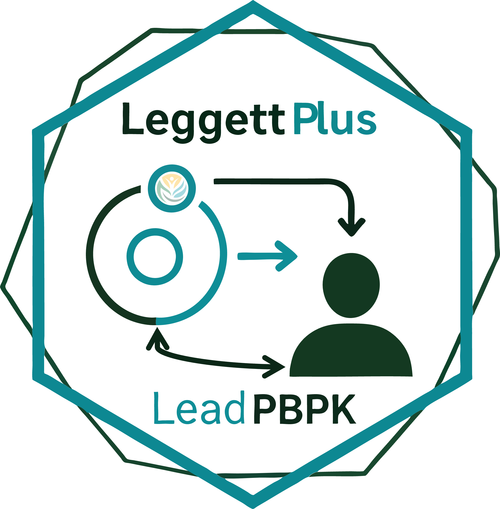

# Leggett+ Lead PBPK Simulator

<!-- badges: start -->

 
[](https://app.codecov.io/gh/OEHHA-NTES/Leggett_Plus)
[](https://github.com/OEHHA-NTES/Leggett_Plus/actions/workflows/R-CMD-check.yaml)
<!-- badges: end -->



**Leggett+** is OEHHA's extended implementation of the age-specific lead (Pb) physiologically based pharmacokinetic (PBPK) model originally developed by [Richard Leggett (1993)](https://pmc.ncbi.nlm.nih.gov/articles/PMC1519877/) and later updated by [Vork, Carlisle and Brown (2013)](https://oehha.ca.gov/sites/default/files/media/downloads/air/document/pbpk2013.pdf); [Vork & Carlisle (2020)](https://doi.org/10.1080/15459624.2020.1743845); and [Vork, Brown, and Carlisle (2023)](https://doi.org/10.1080/15459624.2022.2150767). This R package supports reproducible simulation of occupational, pulse, and retirement exposure scenarios using a 21-compartment system. Originally coded in MATLAB, the model was ported to R by Dr. Kathleen Vork (OEHHA - retired), Dr. Stephen Gilbert (CDC/NIOSH/DSI/REB), [Dr. Hsing-Chieh Lin (TAMU)](https://github.com/hsingchiehlin), and [Dr. Scott Coffin (OEHHA)](https://github.com/ScottCoffin).

## Features

-   PBPK simulation of lead kinetics across 21 physiological compartments
-   Occupational, pulse, and retirement exposure scenarios
-   OEHHA breathing-rate tables with transparent adjustments
-   Time-series outputs suitable for regulatory and decision-support interpretation
-   Verification against legacy MATLAB implementations

## Installation

### CRAN (forthcoming)

``` r
# install.packages("LeggettPlus")
```

### Development version from GitHub

``` r
# install.packages("remotes")
remotes::install_github("OEHHA-NTES/Leggett_Plus")
```

### Installation from Tarball Source

```r
install.packages("path/to/LeggettPlus_0.2.0.tar.gz", repos = NULL, type = "source")
```

## Usage

The package vignette is the primary user guide. Build it locally with:

``` r
vignette("LeggettPlus", package = "LeggettPlus")
```

### Key functions

| Function | Purpose |
|--------------------------------------|----------------------------------|
| `run_leggett_model(schedule)` | Solve the 21-compartment ODE for a multi-stage exposure schedule |
| `summarize_leggett_output(ts, ...)` | Extract compartment values, maxima, and AUC from a model run |
| `leggett_base_parameters(...)` | Build the physiological parameter set (volumes, rate constants) |
| `launch_leggett_app()` | Open the interactive Shiny interface |

### Minimal workflow

``` r
library(LeggettPlus)

# 1. Define exposure stages (one row per stage)
schedule <- data.frame(
  duration                = 365 * 20,  # days
  Occ.background.ug.d     = 25,        # non-air occupational intake (µg/day)
  NonOcc.background.ug.d  = 2.2,       # non-occupational background (µg/day)
  Occ.pb.ug.m3            = 30,        # occupational airborne Pb (µg/m³)
  NonOcc.pb.ug.m3         = 0.15,      # ambient airborne Pb (µg/m³)
  Occ.breath.rate.m3.d    = 30,        # worker breathing rate (m³/day)
  NonOcc.breath.rate.m3.d = 17,        # residential breathing rate (m³/day)
  work.hour.perweek       = 40,        # hours worked per week
  oral.intake.ug.d        = 0          # additional direct oral dose (µg/day)
)

# 2. Run the model
out <- run_leggett_model(schedule, age_years = 30, initial_bll_ug_dl = 0.78)

# 3. Summarize at a time point
summarize_leggett_output(
  out$time_series,
  time_point       = 365 * 10,
  blood_volume_dl  = out$metadata$blood_volume_dl,
  plasma_volume_dl = out$metadata$plasma_volume_dl,
  rbc_volume_dl    = out$metadata$rbc_volume_dl
)

# 4. Or use the Shiny app
launch_leggett_app()
```

See the vignette for full documentation of all schedule columns, scenario types (occupational, retirement, pulse), breathing-rate conversions, and output interpretation.

## Related resources

The R Shiny app and manuscript live in a separate repository: https://github.com/OEHHA-NTES/Leggett_R_Shiny

## Citation

``` r
citation("LeggettPlus")
```

## Disclaimer of intended use

This package was created by the Office of Environmental Health Hazard Assessment (OEHHA), an office within the State of California's Environmental Protection Agency (CalEPA). It is intended for research and exposure-scenario exploration only. Outputs should be interpreted within the context of model assumptions, parameter uncertainty, and available toxicokinetic data. This package should not be used and is not intended to be used for clinical diagnosis or individual medical decision-making. OEHHA provides no warranty for this package, either express or implied, including but not limited to the implied warranties of merchantability or fitness for a particular purpose; it is provided "AS IS." OEHHA disclaims any liability resulting from the use of this package.

**Male-reference physiology.** Leggett+'s physiological parameters and calibration constants (body weight, hematocrit, blood-volume scaling, and RBC binding capacity) are derived from adult male / male-dominated occupational-worker data (Leggett, 1993, and subsequent updates). There is no female-specific parameter set implemented — no separate hematocrit range, blood-volume expansion, or RBC binding capacity for female individuals, including during pregnancy. Simulated results should not be assumed to represent female physiology.

## License

GPL (\>= 2). See `LICENSE.md` for details.

## Contributing

Issues and pull requests are welcome. Please use https://github.com/OEHHA-NTES/Leggett_Plus/issues for bug reports and feature requests.
